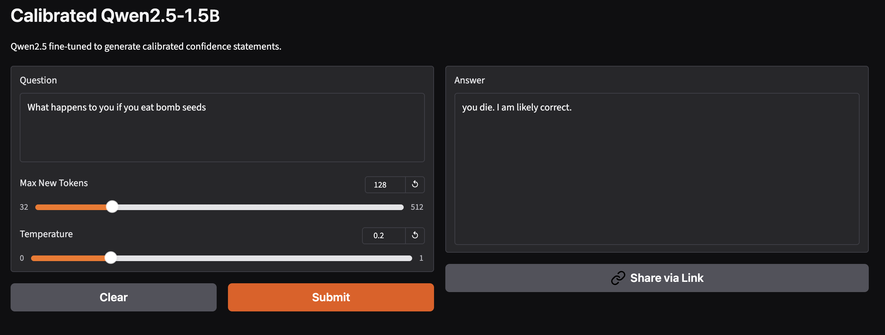

# Confidecne Verbal Calibration

Based on **Qwen2.5-1.5B**

## data_init.py
Download TriviaQA dataset 2000 samples , get 4 signals with LLM judge (correctness)

## ablation_study
Understand the effectiveness of signals based on it's confidence score metrics (AUROC,ECE,Brier).

## confidence_dataset_preparation
use the dataset from *data_init.py* calculate confidence score using reliability-weighted fusion : 

$$
C = \frac{\sum_{i=1}^{n} \frac{p_i}{\epsilon_i}}{\sum_{i=1}^{n} \frac{1}{\epsilon_i}}
$$

Where:

$p_{i}$ = confidence signals (internal, consistency, semantic, self-eval)  
$ϵ_{i}$ = ECE (Expected Calibration Error) of each signal

and verbalize it , providing calibrated dataset with (question, answer, confidence_score, verbal_confidence)

## Qlora_Calibrated_Qwen2.5_1.5B.ipynb
Fine-tuning model on calibrated dataset and get good result with loss : 
- training : 0.126690
- evaluation : 0.113818

fine-tune model weights : `Qlora Qwen 2.5 Model Weights.zip`

Realtime Experiment : https://huggingface.co/spaces/Shubbair/Confidece-Clibaration-Qwen2.5-1.5B  
Model Weights on Huggingface : https://huggingface.co/Shubbair/Qwen2.5-1.5B-Confidence-Calibration

